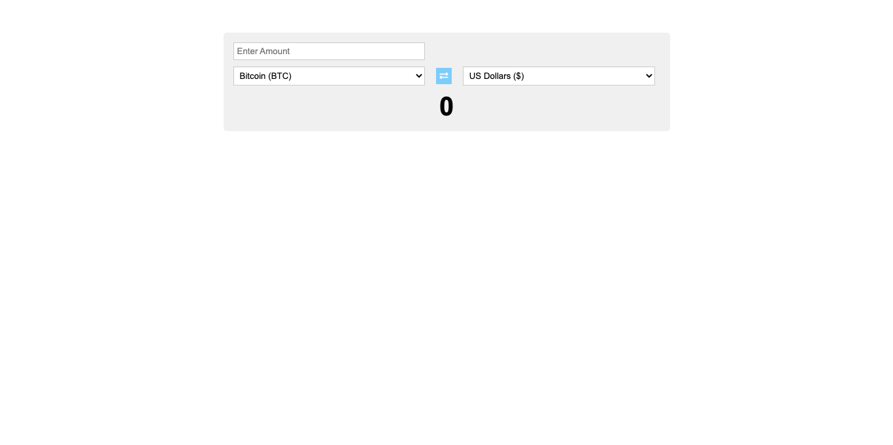

# Currency exchange system

> A Web App that can convert Crypto-Currency to fiat and vice-versa.



- A User can convert three fiat currencies (US Dollars (USD), British Pounds (GBP), Uganda Shillings (UGX) to three crypto-currencies (Bitcoin (BTC), NameCoin (NMC), and Litecoin (LIT)), and vice-versa.

## Built With

- JSX, CSS
- React

# Set Up
## Clone This Repository
```
$ git clone https://github.com/emmyobonyo/opareta-front-end-interview-question.git
$ cd operata-front-end-interview-question.git
```

## Run Project
```
$ npm install
$ npm start
```

## Authors

👤 **Emmanuel Obonyo**

- GitHub: [@emmyobonyo](https://github.com/emmyobonyo)
- Twitter: [@emmyobonyo](https://twitter.com/emmyobonyo)
- LinkedIn: [Emmanuel Obonyo](https://www.linkedin.com/in/emmanuel-obonyo-3728a2200/)

## 🤝 Contributing

Contributions, issues, and feature requests are welcome!

Feel free to check the [issues page](https://github.com/emmyobonyo/opareta-front-end-interview-question/issues).

## Show your support

Give a ⭐️ if you like this project!
